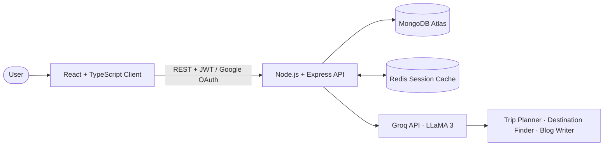
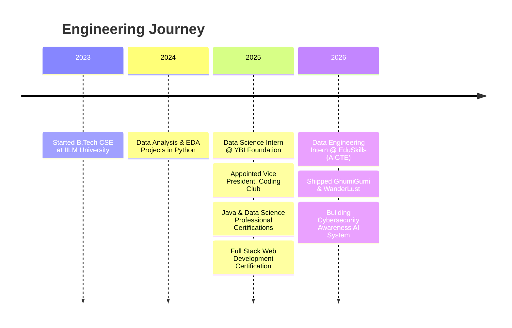

<div align="center">
  
  
  <p align="center">
    <a href="https://portfolio-salman-khan4.vercel.app/"></a>
    <a href="https://www.linkedin.com/in/khansalman2005"></a>
    <a href="mailto:khansalmanacc@gmail.com"></a>
  </p>
</div>

```bash
$ whoami
```

```json
{
  "name": "Salman Khan",
  "role": "Full-Stack Developer | Data Engineering & AI Enthusiast",
  "education": "B.Tech CSE (Final Year), IILM University | CGPA 9.03/10",
  "location": "Greater Noida, India",
  "leadership": "Vice President, Coding Club",
  "currently_building": "AI chatbot for cybersecurity awareness training",
  "currently_learning": ["Advanced Java data structures", "LeetCode problem-solving patterns"],
  "ask_me_about": ["React", "Node.js", "MongoDB", "Redis caching", "LLM API integration", "Java DSA"],
  "open_to": "Collaborating on full-stack and AI-powered products"
}
```

---

### 💻 `about --me`

I am a final-year Computer Science Engineering student at IILM University, Greater Noida, with a CGPA of **9.03/10**. I love taking ideas from an empty directory to a live URL: designing the data model, engineering scalable APIs, implementing authentication and caching, and delivering responsive, production-ready interfaces.

Most of my work sits at the intersection of **Full-Stack Engineering, Applied AI, and Data Pipelines**. I build applications powered by LLMs (such as Groq with LLaMA 3) and process datasets end-to-end (cleaning, exploratory analysis, modeling, and dashboarding).

#### 🎯 What I Focus On
- **Complete Full-Stack Products:** React, TypeScript, Node.js, Express, MongoDB Atlas, MySQL, and secure auth (JWT, OAuth, Passport.js).
- **Performance & Reliability:** Redis session caching, efficient pagination, and resilient deployments on Render and Vercel.
- **Applied AI:** Integrating LLM APIs (Groq, LLaMA 3) for contextual tools like trip planners, content generators, and assistants.
- **Data Engineering:** Data wrangling with Pandas/NumPy, visualization with Seaborn/Matplotlib, and ETL pipeline fundamentals with AWS Academy.
- **Core CS Foundations:** Algorithms & Data Structures in Java, OOP, DBMS, and OS fundamentals.

---

### 🛠️ `stack --list`

<div align="center">

| Domain | Technologies & Frameworks |
| :--- | :--- |
| **Languages** |      |
| **Frontend** |      |
| **Backend & Auth** |     |
| **Databases & Cache** |    |
| **Data Science & ML** |     |
| **Cloud & DevOps** |      |
| **AI & LLMs** |   |

</div>

<details>
<summary><b>📚 Click to view full tech stack breakdown</b></summary>

<br/>

| Area | Technologies | Primary Use Case |
| :--- | :--- | :--- |
| **Languages** | Python, Java, JavaScript, TypeScript, SQL | Web apps, data analysis, DSA practice, database queries |
| **Front end** | React, Tailwind CSS, Bootstrap, HTML5, CSS3 | Responsive interfaces and component-driven UIs |
| **Back end** | Node.js, Express.js, REST APIs, Passport.js, JWT, OAuth | API design, authentication, and authorization pipelines |
| **Databases** | MongoDB Atlas, Mongoose, MySQL, Redis | Persistent storage, relational schemas, session caching |
| **Data & ML** | Pandas, NumPy, Matplotlib, Seaborn, Jupyter, EDA | Cleaning, exploring, visualising, and modeling data |
| **Cloud & Tools**| AWS Academy, Docker, Git, GitHub, Postman, Linux | Cloud environments, containerization, version control, API testing |
| **AI Integration**| Groq API, LLaMA 3, Prompt Engineering | Applied AI features inside full-stack applications |
| **CS Core** | DSA, OOP, DBMS, Computer Networks, OS | Problem solving and low-level system understanding |

</details>

---

### 🚀 `projects --featured`

<table>
  <tr>
    <td width="50%" valign="top">
      <h3>🧳 GhumiGumi</h3>
      <p><b>AI-Powered Travel Blog Platform</b></p>
      <p>Secure JWT + Google OAuth, full CRUD, admin dashboard, and Groq-powered AI Trip Planner, Destination Finder, and Blog Writer. Redis session caching cuts latency significantly.</p>
      <p>
        <a href="https://ghumigumi-1.onrender.com/"><b>▶ Live Demo</b></a>
      </p>
    </td>
    <td width="50%" valign="top">
      <h3>🏡 WanderLust</h3>
      <p><b>Airbnb-Style Travel Listings Platform</b></p>
      <p>Category filtering, pagination, Passport.js authentication, and Cloudinary media uploads. Built on MongoDB Atlas and deployed on Render with an ocean teal interface.</p>
      <p>
        <a href="https://wanderlust-full-stack-project-fbuz.onrender.com/"><b>▶ Live Demo</b></a>
      </p>
    </td>
  </tr>
  <tr>
    <td width="50%" valign="top">
      <h3>💸 Personal Finance Dashboard</h3>
      <p><b>Budgeting & Spending Analytics</b></p>
      <p>Automated expense categorization, monthly spending-trend analysis, financial report generation, and interactive visual data representations in Python.</p>
      <p>
        <a href="https://github.com/SalmanKhan123-dev/Personal-Finance-Dashboard"><b>▶ View Repository</b></a>
      </p>
    </td>
    <td width="50%" valign="top">
      <h3>🛡️ Cybersecurity Awareness Chatbot</h3>
      <p><b>AI Chatbot for Security Training (In Progress)</b></p>
      <p>Major project grounded in published research (WISE 2024 & CYBER 2022) to make cybersecurity awareness training interactive and accessible.</p>
    </td>
  </tr>
</table>

<details>
<summary><b>🔍 Project Deep Dives & System Architecture</b></summary>

<br/>

#### 🧳 GhumiGumi Architecture


- **Challenges Solved:** Port binding on Render hosts, TypeScript build errors, MongoDB Atlas dynamic IP whitelist management, and Redis connectivity under high-concurrency requests.
- **Link:** [Live Demo](https://ghumigumi-1.onrender.com/)

---

#### 🏡 WanderLust Architecture
- **Features:** Server-rendered EJS with custom Bootstrap ocean theme, Passport.js session auth, Cloudinary image upload pipeline.
- **Lessons Learned:** Handled session cookies behind proxy hosts, configured Atlas seed scripts, and implemented sanitization for user inputs.
- **Link:** [Live Demo](https://wanderlust-full-stack-project-fbuz.onrender.com/)

---

#### 🌐 Portfolio Website
- **Features:** Hero card, interactive project gallery, downloadable CV, and EmailJS-powered contact channel.
- **Links:** [Live Site](https://portfolio-salman-khan4.vercel.app/) · [GitHub Code](https://github.com/SalmanKhan123-dev/Portfolio)

</details>

---

### ⏳ `journey --timeline`



---

### 🎓 `education & experience`

| Institution / Company | Program / Role | Period | Details |
| :--- | :--- | :--- | :--- |
| **IILM University, Greater Noida** | B.Tech, Computer Science Engineering | Aug 2023 – May 2027 | **CGPA: 9.03/10** (Final Year) |
| **EduSkills Foundation (AICTE)** | Data Engineering Virtual Intern | Apr 2026 – Jun 2026 | Cloud data workflows, ETL pipelines, AWS Academy |
| **YBI Foundation Pvt. Ltd.** | Data Science Intern | May 2025 – Jul 2025 | Data preprocessing, EDA, ML models, Pandas/NumPy |
| **IILM Coding Club** | Vice President | Aug 2025 – Present | Technical events, hackathons, Tech Hunt lead |
| **Saint Angels Public School** | Senior Secondary (CBSE XII) | Apr 2020 – Mar 2022 | **Score: 90%** |

---

### 🧩 `problem-solving & other repos`

I regularly solve Data Structures and Algorithms problems in Java on LeetCode with a focus on problem patterns, complexity optimization, and clean code.

| Repository | Focus & Highlights |
| :--- | :--- |
| [📂 LEETCODE](https://github.com/SalmanKhan123-dev/LEETCODE) | Curated LeetCode solutions in Java with explanations |
| [📂 Java-Programming](https://github.com/SalmanKhan123-dev/Java-Programming) | Core & advanced Java principles, collections, and OOP |
| [📂 Compiler-Design](https://github.com/SalmanKhan123-dev/Compiler-Design) | Lexical analysis, parsers, and compiler coursework in Java |
| [📂 Spotify_Clone](https://github.com/SalmanKhan123-dev/Spotify_Clone) | Pure HTML/CSS UI clone of Spotify desktop interface |
| [📂 WebDev_practice](https://github.com/SalmanKhan123-dev/WebDev_practice) | Hands-on experiments with modern web APIs |

---

### 📊 `stats --live`

<div align="center">
  
  
</div>

---

<div align="center">
  
  <p><b>Let's build something impactful together!</b></p>
</div>
