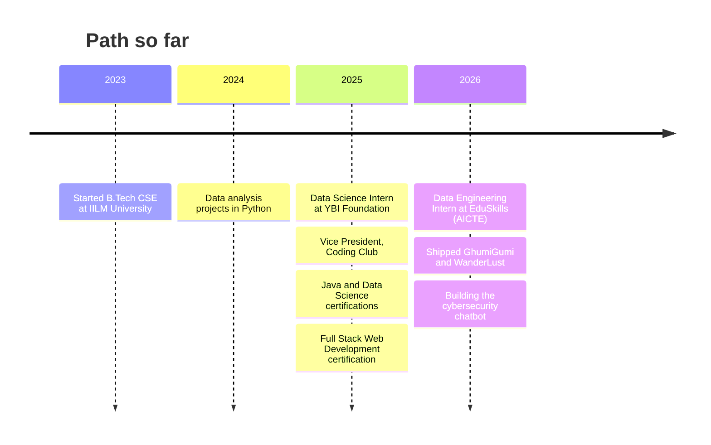

<div align="center">


<br/>

[](https://portfolio-salman-khan4.vercel.app/)
[](https://www.linkedin.com/in/khansalman2005)
[](mailto:khansalmanacc@gmail.com)

</div>

## `> whoami`

```json
{
  "name": "Salman Khan",
  "role": "Full-Stack Developer | Data Engineering & Data Science Enthusiast",
  "education": "B.Tech CSE (Final Year), IILM University | CGPA 9.03/10",
  "location": "Greater Noida, India",
  "leadership": "Vice President, Coding Club",
  "currently_building": "AI chatbot for cybersecurity awareness training",
  "currently_learning": ["Advanced Java data structures", "LeetCode problem-solving patterns"],
  "ask_me_about": ["React", "Node.js", "MongoDB", "Redis caching", "LLM API integration", "Java DSA"],
  "open_to": "Collaborating on full-stack and AI-powered projects"
}
```

<br/>

## `> about --me`

I'm a final-year **B.Tech Computer Science Engineering** student at **IILM University, Greater Noida**, with a CGPA of 9.03/10. I enjoy taking a product from an empty folder to a live URL: designing the data model, building the API, wiring authentication, adding caching, shaping the interface and finally deploying it so anyone can use it.

Most of my projects sit where **full-stack engineering** meets **applied AI and data**. I've built platforms that use LLMs for trip planning and content writing, and I've worked with real datasets end to end: cleaning, exploring, modelling and presenting the results. My internships in **data science** and **data engineering** gave me hands-on practice with Python, ETL pipelines and cloud data services.

Outside of projects, I practise **data structures and algorithms in Java** on LeetCode, and as **Vice President of the university Coding Club** I help organise technical events that get students solving problems together.

### What I focus on

- **Building complete products:** React and TypeScript front ends, Node.js and Express back ends, MongoDB and MySQL databases, secure login with JWT, OAuth and Passport.js.
- **Making apps fast and dependable:** Redis session caching, pagination, sensible data models, and deployment on Render and Vercel.
- **Adding practical AI:** calling LLM APIs (Groq with LLaMA 3) to power features users actually touch, such as a trip planner, a destination finder and a blog writer.
- **Working with data:** cleaning and exploring datasets with Pandas and NumPy, visualising with Matplotlib and Seaborn, and learning ETL and pipeline fundamentals on AWS Academy.
- **Strong fundamentals:** data structures, algorithms, OOP, DBMS and operating systems.

### How I work

- I ship early, deploy often and learn from what breaks. I've debugged real deployment problems such as port conflicts, build failures, database connection errors and cache configuration.
- I prefer working code I can run and observe over abstract plans.
- I document what I learn so the next project starts faster.

<br/>

## `> stack --list`

<div align="center">

</div>

<details>
<summary><b>📚 Full tech stack, in detail</b></summary>

<br/>

| Area | Technologies | What I use them for |
|---|---|---|
| **Languages** | Python, Java, JavaScript, TypeScript, SQL | Web apps, data analysis, DSA practice and database queries |
| **Front end** | HTML, CSS, Bootstrap, Tailwind CSS, React | Responsive interfaces and component-based UIs |
| **Back end** | Node.js, Express.js, REST APIs, Passport.js, JWT, OAuth | APIs, authentication and authorization |
| **Databases** | MongoDB (Atlas, Mongoose), MySQL, Redis | Persistent data, relational queries and session caching |
| **Data & ML** | Pandas, NumPy, Matplotlib, Seaborn, Jupyter, EDA | Cleaning, exploring, visualising and modelling data |
| **Cloud & tools** | AWS Academy, Docker, Git, GitHub, Postman, Linux, Figma, VS Code, Google Colab | Cloud labs, containers, version control, API testing and design |
| **AI** | Groq API, LLaMA 3, prompt design | AI features inside full-stack products |
| **CS fundamentals** | Data Structures & Algorithms, OOP, DBMS, Operating Systems | Problem solving and system understanding |

</details>

<br/>

## `> projects --featured`

<table>
<tr>
<td width="50%" valign="top">

### 🧳 GhumiGumi
**AI-powered travel blog platform**

JWT and Google OAuth login, full CRUD, admin dashboard, and AI Trip Planner, Destination Finder and Blog Writer. Redis session caching reduces response latency.


[**▶ Live Demo**](https://ghumigumi-1.onrender.com)

</td>
<td width="50%" valign="top">

### 🏡 WanderLust
**Airbnb-style travel listings platform**

Category filtering, pagination, Passport.js authentication and Cloudinary image uploads on MongoDB Atlas, deployed on Render.


[**▶ Live Demo**](https://wanderlust-full-stack-project-fbuz.onrender.com)

</td>
</tr>
<tr>
<td width="50%" valign="top">

### 💸 Personal Finance Dashboard
**Budgeting and spending analytics**

Automated expense categorisation, monthly spending-trend analysis, report generation and an interactive dashboard.


[**▶ View Code**](https://github.com/SalmanKhan123-dev/Personal-Finance-Dashboard)

</td>
<td width="50%" valign="top">

### 🛡️ Cybersecurity Awareness Chatbot
**AI chatbot for security training** *(in progress)*

Designed from published research on GPT-enabled cybersecurity learning, aimed at making awareness training interactive and efficient.


</td>
</tr>
</table>

### Project deep dives

<details>
<summary><b>🧳 GhumiGumi: features, architecture and what I solved</b></summary>

<br/>

**What it is:** a full-stack travel blog platform where people can read and publish travel stories, and use AI tools to plan trips and write posts.

**Key features**
- Secure sign-in with **JWT** and **Google OAuth**
- Full **CRUD** for blog posts and an **admin dashboard** for managing content
- **AI Trip Planner**, **Destination Finder** and **Blog Writer** powered by the **Groq API (LLaMA 3)**
- **Redis session caching** to cut response latency
- TypeScript on both the React front end and the Node.js / Express back end
- Deployed on **Render**

**Challenges I worked through:** port binding on the host, build failures, MongoDB connection errors and Redis configuration in a deployed environment.


[▶ Live Demo](https://ghumigumi-1.onrender.com)

</details>

<details>
<summary><b>🏡 WanderLust: features and deployment lessons</b></summary>

<br/>

**What it is:** an Airbnb-style web application where users browse and create travel listings.

**Key features**
- Full **CRUD** on listings with **category tagging** and **pagination**
- Authentication with **Passport.js**
- Image uploads through **Cloudinary**
- Server-rendered pages with **EJS** and a **Bootstrap** interface with a custom teal ocean theme
- Data stored in **MongoDB Atlas** via Mongoose, deployed on **Render**

**What I learned:** MongoDB Atlas must allow Render's dynamic IPs, seed scripts should target the Atlas connection explicitly, and sessions need care when an app runs behind a hosting proxy.

[▶ Live Demo](https://wanderlust-full-stack-project-fbuz.onrender.com)

</details>

<details>
<summary><b>💸 Personal Finance Dashboard: what it does</b></summary>

<br/>

**What it is:** a Python application for personal budgeting.

**Key features**
- **Automated expense categorisation**
- **Monthly spending-trend analysis**
- **Financial report generation**
- An **interactive dashboard** for tracking spending patterns with clear, intuitive visualisations

**Built with:** Python, Pandas and Matplotlib.

[▶ View Code](https://github.com/SalmanKhan123-dev/Personal-Finance-Dashboard)

</details>

<details>
<summary><b>🌐 Portfolio Website: what's inside</b></summary>

<br/>

A personal portfolio with a hero photo card, a project gallery, a downloadable resume and a working contact form powered by **EmailJS**. I've iterated on its visual theme several times, moving from a dark gold-and-black look to a light neutral palette with gradient accents.

[▶ Live Site](https://portfolio-salman-khan4.vercel.app/) · [▶ View Code](https://github.com/SalmanKhan123-dev/Portfolio)

</details>

<details>
<summary><b>🛡️ Cybersecurity Awareness Chatbot: research behind it</b></summary>

<br/>

My major project is an AI chatbot for cybersecurity awareness training. I'm grounding the design in published research, including *GPT-Enabled Cybersecurity Training* (WISE 2024) and *Efficiency of an AI Chatbot for IT-Awareness and Cybersecurity Learning* (CYBER 2022).

</details>

<br/>

## `> journey --timeline`



<br/>

## `> education`

| Institution | Program | Period | Result |
|---|---|---|---|
| **IILM University**, Greater Noida | B.Tech, Computer Science Engineering | Aug 2023 – May 2027 | CGPA 9.03/10 (Final Year) |
| **Saint Angels Public School**, Baghpat | Senior Secondary (Class XII), CBSE | Apr 2020 – Mar 2022 | 90% |

<br/>

## `> experience --expand`

<details open>
<summary><b>💼 Data Engineering Virtual Intern</b> · EduSkills Foundation (AICTE) · <i>Apr 2026 – Jun 2026</i></summary>

<br/>

- Completed a structured data engineering program covering **ETL processes, data pipelines, cloud computing fundamentals and data-management techniques** on AWS Academy.
- Applied modern data-engineering workflows through **hands-on labs** with structured datasets and cloud data services.

</details>

<details>
<summary><b>📈 Data Science Intern</b> · YBI Foundation Pvt. Ltd. · <i>May 2025 – Jul 2025</i></summary>

<br/>

- Analysed real-world datasets end to end in **Python (Pandas, NumPy)**: data cleaning, preprocessing and exploratory data analysis.
- Built and evaluated **machine learning models** for prediction tasks and communicated findings through clear data visualisations.

</details>

<details>
<summary><b>🏆 Vice President, Coding Club</b> · IILM University · <i>Aug 2025 – Present</i></summary>

<br/>

- Organised and led the technical event **Tech Hunt** to promote problem-solving and teamwork among students.

</details>

<details>
<summary><b>🎓 Certifications</b></summary>

<br/>

- **Full Stack Web Development**, Apna College (Dec 2025)
- **Java Programming Fundamentals**, Infosys Springboard (Aug 2025)
- **Data Science with Python**, Infosys Springboard (Apr 2025)

</details>

<br/>

## `> problem-solving`

I practise **data structures and algorithms in Java** and solve problems on **LeetCode**, recently working through linked lists, from understanding the concept to writing runnable code and tracing it step by step. My practice lives in the repositories below.

<br/>

## `> repos --other`

| Repository | What's inside |
|---|---|
| [LEETCODE](https://github.com/SalmanKhan123-dev/LEETCODE) | LeetCode solutions in Java |
| [Java-Programming](https://github.com/SalmanKhan123-dev/Java-Programming) | Java practice and fundamentals |
| [Compiler-Design](https://github.com/SalmanKhan123-dev/Compiler-Design) | Compiler design coursework in Java |
| [Spotify_Clone](https://github.com/SalmanKhan123-dev/Spotify_Clone) | HTML/CSS Spotify UI clone from the start of my web development journey |
| [WebDev_practice](https://github.com/SalmanKhan123-dev/WebDev_practice) | Web development practice exercises |

<br/>

## `> next --goals`

- Finish and publish the **cybersecurity awareness chatbot**.
- Go deeper into **data engineering**: pipelines, cloud data services and larger datasets.
- Keep sharpening **DSA and competitive programming** in Java.
- Build more **AI-powered full-stack products** and get them in front of real users.

<br/>

## `> stats --live`

<div align="center">


<br/><br/>


<br/><br/>

<picture>
  <source media="(prefers-color-scheme: dark)" srcset="https://raw.githubusercontent.com/SalmanKhan123-dev/SalmanKhan123-dev/output/github-snake-dark.svg" />
  <source media="(prefers-color-scheme: light)" srcset="https://raw.githubusercontent.com/SalmanKhan123-dev/SalmanKhan123-dev/output/github-snake.svg" />
  
</picture>

</div>

<br/>

## `> contact --open`

I'm always happy to talk about full-stack and AI projects, collaboration, DSA problems or Coding Club events. The fastest way to reach me is email or LinkedIn.

| | |
|---|---|
| 🌐 **Portfolio** | [portfolio-salman-khan4.vercel.app](https://portfolio-salman-khan4.vercel.app/) |
| 💼 **LinkedIn** | [linkedin.com/in/khansalman2005](https://www.linkedin.com/in/khansalman2005) |
| 📧 **Email** | [khansalmanacc@gmail.com](mailto:khansalmanacc@gmail.com) |

<div align="center">

</div>
