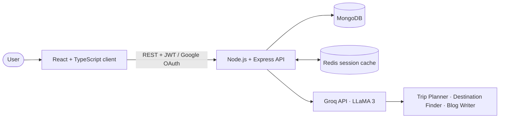
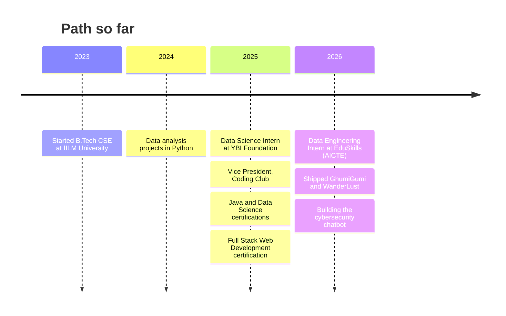

<div align="center">


<br/>

[](https://portfolio-salman-khan4.vercel.app/)
[](https://www.linkedin.com/in/khansalman2005)
[](mailto:khansalmanacc@gmail.com)

</div>

## `> whoami`

```json
{
  "name": "Salman Khan",
  "role": "Full-Stack Developer | Data Engineering & Data Science Enthusiast",
  "education": "B.Tech CSE (Final Year), IILM University | CGPA 9.03/10",
  "location": "Greater Noida, India",
  "leadership": "Vice President, Coding Club",
  "currently_building": "AI chatbot for cybersecurity awareness training",
  "currently_learning": ["Advanced Java data structures", "LeetCode problem-solving patterns"],
  "ask_me_about": ["React", "Node.js", "MongoDB", "Redis caching", "LLM API integration", "Java DSA"],
  "open_to": "Collaborating on full-stack and AI-powered projects"
}
```

<br/>

## `> stack --list`

<div align="center">

</div>

<br/>

## `> projects --featured`

<table>
<tr>
<td width="50%" valign="top">

### 🧳 GhumiGumi
**AI-powered travel blog platform**

JWT and Google OAuth login, full CRUD, admin dashboard, and AI Trip Planner, Destination Finder and Blog Writer. Redis session caching reduces response latency.


[**▶ Live Demo**](https://ghumigumi-1.onrender.com)

</td>
<td width="50%" valign="top">

### 🏡 WanderLust
**Airbnb-style travel listings platform**

Category filtering, pagination, Passport.js authentication and Cloudinary image uploads on MongoDB Atlas, deployed on Render.


[**▶ Live Demo**](https://wanderlust-full-stack-project-fbuz.onrender.com)

</td>
</tr>
<tr>
<td width="50%" valign="top">

### 💸 Personal Finance Dashboard
**Budgeting and spending analytics**

Automated expense categorisation, monthly spending-trend analysis, report generation and an interactive dashboard.


[**▶ View Code**](https://github.com/SalmanKhan123-dev/Personal-Finance-Dashboard)

</td>
<td width="50%" valign="top">

### 🛡️ Cybersecurity Awareness Chatbot
**AI chatbot for security training** *(in progress)*

Designed from published research on GPT-enabled cybersecurity learning, aimed at making awareness training interactive and efficient.


</td>
</tr>
</table>

<details>
<summary><b>🧩 How GhumiGumi works (architecture)</b></summary>

<br/>



</details>

<br/>

## `> journey --timeline`



<br/>

## `> experience --expand`

<details open>
<summary><b>💼 Data Engineering Virtual Intern</b> · EduSkills Foundation (AICTE) · <i>Apr 2026 – Jun 2026</i></summary>

<br/>

ETL processes, data pipelines, cloud computing fundamentals and data-management techniques on AWS Academy, through hands-on labs with structured datasets and cloud data services.

</details>

<details>
<summary><b>📈 Data Science Intern</b> · YBI Foundation Pvt. Ltd. · <i>May 2025 – Jul 2025</i></summary>

<br/>

End-to-end analysis of real-world datasets in Python (Pandas, NumPy): cleaning, preprocessing and EDA. Built and evaluated machine learning models for prediction tasks and communicated findings through clear visualisations.

</details>

<details>
<summary><b>🏆 Vice President, Coding Club</b> · IILM University · <i>Aug 2025 – Present</i></summary>

<br/>

Organised and led the technical event **Tech Hunt** to promote problem-solving and teamwork among students.

</details>

<details>
<summary><b>🎓 Certifications</b></summary>

<br/>

- **Full Stack Web Development**, Apna College (Dec 2025)
- **Java Programming Fundamentals**, Infosys Springboard (Aug 2025)
- **Data Science with Python**, Infosys Springboard (Apr 2025)

</details>

<br/>

## `> stats --live`

<div align="center">


<br/><br/>


<br/><br/>

<picture>
  <source media="(prefers-color-scheme: dark)" srcset="https://raw.githubusercontent.com/SalmanKhan123-dev/SalmanKhan123-dev/output/github-snake-dark.svg" />
  <source media="(prefers-color-scheme: light)" srcset="https://raw.githubusercontent.com/SalmanKhan123-dev/SalmanKhan123-dev/output/github-snake.svg" />
  
</picture>

</div>

<br/>

## `> contact --open`

| | |
|---|---|
| 🌐 **Portfolio** | [portfolio-salman-khan4.vercel.app](https://portfolio-salman-khan4.vercel.app/) |
| 💼 **LinkedIn** | [linkedin.com/in/khansalman2005](https://www.linkedin.com/in/khansalman2005) |
| 📧 **Email** | [khansalmanacc@gmail.com](mailto:khansalmanacc@gmail.com) |

<div align="center">

</div>
